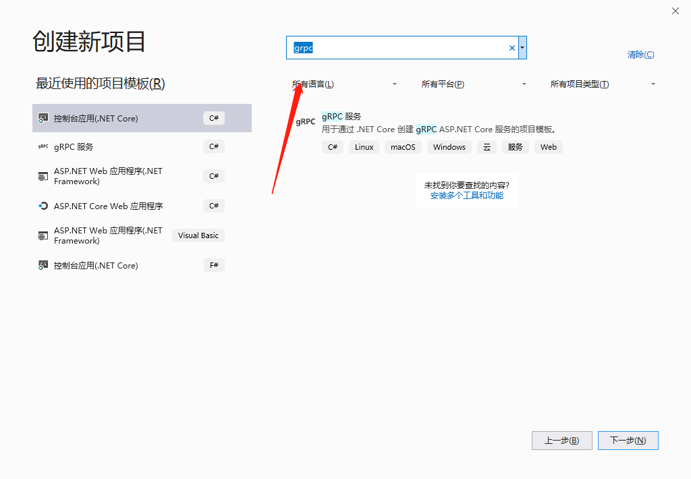
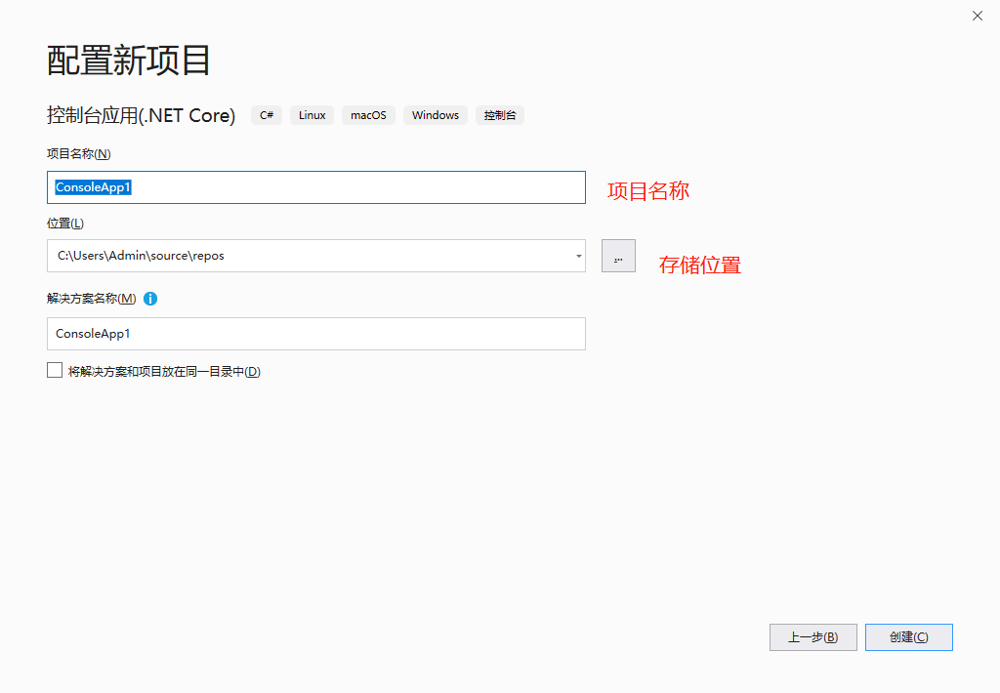
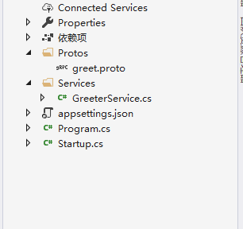
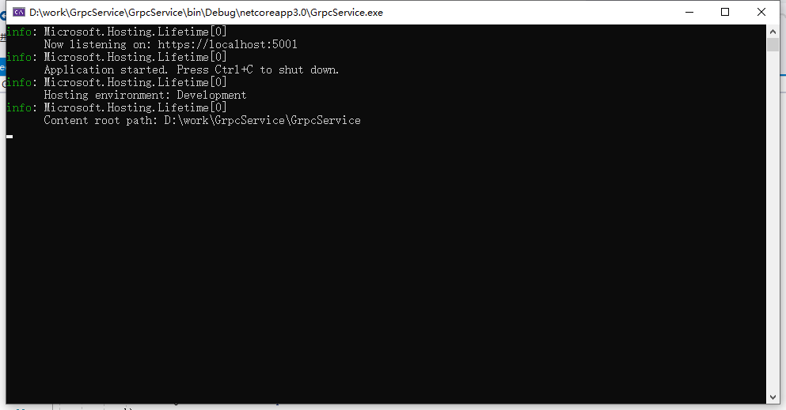
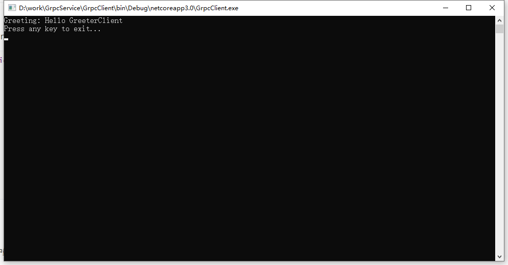

vs2019默认安装了.net core 3，在创建项目的时候可以选择 grpc这个项目模板






创建好的项目结构



这里面 greet.proto是 基于google protobuf的文件，它的在这里的定义如下:

```c#
syntax = "proto3";

option csharp_namespace = "GrpcService1";

package Greet;

// The greeting service definition.
service Greeter {
  // Sends a greeting
  rpc SayHello (HelloRequest) returns (HelloReply);
}

// The request message containing the user's name.
message HelloRequest {
  string name = 1;
}

// The response message containing the greetings.
message HelloReply {
  string message = 1;
}

```


然后 GreeterService.cs 是 根据 proto文件来自动生成的服务，里面实现了SayHello这个方法

直接F5启动 测试服务是否可以正常启动:



这就是正常启动了


然后在新建一个 控制台项目，作为客户端。客户度这边需要用nuget引用3个包

```
Grpc.Net.Client，其中包含 .NET Core 客户端。
Google.Protobuf 包含适用于 C# 的 Protobuf 消息。
Grpc.Tools 包含适用于 Protobuf 文件的 C# 工具支持。 运行时不需要工具包，因此依赖项标记为 PrivateAssets="All"。

```

然后把服务端那边的 Protos 文件夹直接复制到客户端下面，并且把文件目录添加到 工程文件里面去

 右键单击项目，并选择“编辑项目文件” 。 

```xml
<ItemGroup>
  <Protobuf Include="Protos\greet.proto" GrpcServices="Client" />
</ItemGroup>
```


修改main方法，用这段代码覆盖原来的main 方法:

```c#
 static async Task Main(string[] args)
        {
            // The port number(5001) must match the port of the gRPC server.
            var channel = GrpcChannel.ForAddress("https://localhost:5001");
            var client = new Greeter.GreeterClient(channel);
            var reply = await client.SayHelloAsync(
                              new HelloRequest { Name = "GreeterClient" });
            Console.WriteLine("Greeting: " + reply.Message);
            Console.WriteLine("Press any key to exit...");
            Console.ReadKey();
        }

```


编译客户端代码，然后启动 服务端，客户端，就可以看到客户端收到了服务端发过来的数据了



